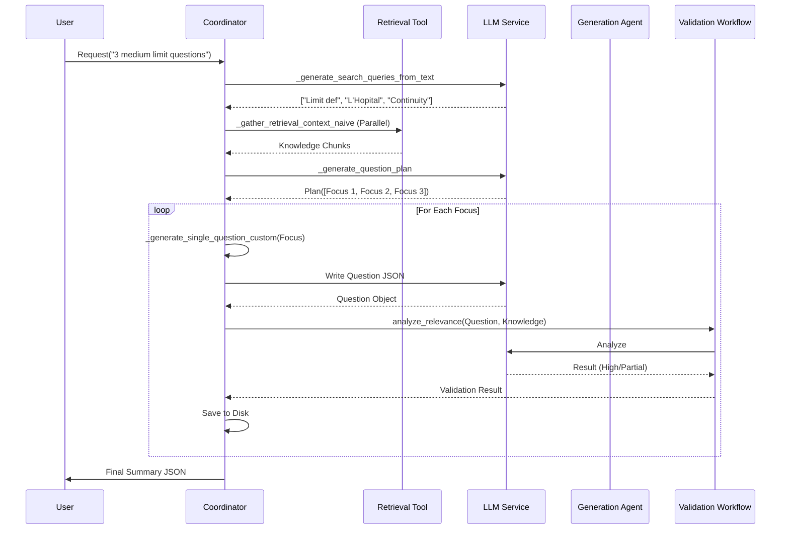

# Requirement: Custom Practice Mode (Knowledge-Driven)

## 🎯 User Stories

### Granular User Stories

#### 1. Retrieval & Research
-   **As a system**, I want to interpret the user's natural language request to extract specific metadata (Topic, Difficulty, Question Type).
-   **As a system**, I want to generate multiple distinct search queries based on the topic to ensure broad coverage of the knowledge base.
-   **As a system**, I want to retrieve knowledge chunks in parallel using RAG to minimize latency.
-   **As a system**, I want to summarize the retrieved chunks into a cohesive "Background Knowledge" context for the LLM.

#### 2. Planning
-   **As a system**, I want to generate a "Question Plan" that lists distinct focuses for `N` questions.
-   **As a system**, I want to ensure each focus is unique (e.g., "Concept Definition" vs "Problem Solving" vs "Edge Case") to avoid repetitive questions.

#### 3. Generation & Validation
-   **As a system**, I want to generate a question based on a specific focus and the background knowledge.
-   **As a system**, I want to validate the generated question for "Relevance" (High vs Partial) instead of just rejecting it.
-   **As a system**, I want to save the final question artifacts (JSON, Markdown) to disk for persistence.

## 🔧 Detailed Design

### Function Specifications

The following table details the key functions in `src/agents/question/coordinator.py` and related modules that implement this logic.

| Function | Signature | Purpose | Logic Details |
| :--- | :--- | :--- | :--- |
| `generate_questions_custom` | `(base_requirement: dict, num_questions: int) -> dict` | **Main Entry Point**. Orchestrates the Research -> Plan -> Generate workflow. | 1. Calls `_generate_search_queries_from_text`<br>2. Calls `_gather_retrieval_context_naive`<br>3. Calls `_generate_question_plan`<br>4. Loops through plan to call `_generate_single_question_custom` |
| `_generate_search_queries_from_text` | `(requirement_text: str, num_queries: int) -> list[str]` | Converts user text into optimized RAG queries. | Uses LLM to extract "Pure Knowledge Point Names" (e.g., "Taylor Theorem") suitable for vector search, avoiding instruction text. |
| `_gather_retrieval_context_naive` | `(queries: list[str]) -> list[dict]` | Executes parallel RAG searches. | Uses `asyncio.gather` to run `rag_search` for each query. Returns a list of `{query, answer}` objects. |
| `_generate_question_plan` | `(base_req: dict, knowledge: str, num: int) -> dict` | Creates a blueprint for distinct questions. | Prompts LLM to output a JSON list of `focus` objects. Ensures distinct angles (e.g., calculation vs theory). |
| `_generate_single_question_custom` | `(focus: dict, base_req: dict, knowledge: str) -> dict` | Generates one question artifact. | Prompts LLM with specific focus + knowledge. Returns strict JSON with question text, options, answer, and explanation. |
| `QuestionValidationWorkflow.analyze_relevance` | `(question: dict, knowledge_summary: str) -> dict` | Validates the output quality. | Analyzes if the question is supported by the KB. Returns `high` (fully supported) or `partial` (extends beyond KB). |

### Logic Flow

The Custom Practice Mode follows a strict **Research -> Plan -> Execute** pipeline. This ensures that questions are distinct from each other and grounded in facts.

#### Mermaid Sequence Diagram



### Data Structures

#### Question Plan
The blueprint generated during the planning phase.
```json
{
  "focuses": [
    {
      "id": "q_1",
      "focus": "Test continuity definition at a point",
      "type": "choice"
    },
    {
      "id": "q_2",
      "focus": "Calculate limit using L'Hopital's rule",
      "type": "written"
    }
  ]
}
```

#### Generated Question (JSON)
The final artifact produced by the agent.
```json
{
  "question_type": "choice",
  "question": "Evaluate the limit of f(x) as x approaches 0...",
  "options": {
    "A": "0",
    "B": "1",
    "C": "Infinity",
    "D": "Undefined"
  },
  "correct_answer": "B",
  "explanation": "Using the standard limit identity sin(x)/x -> 1...",
  "knowledge_point": "Limits"
}
```

#### Validation Output
```json
{
  "relevance": "high",
  "kb_coverage": "The question tests the standard limit identity which is explicitly covered in the provided text.",
  "extension_points": ""
}
```
