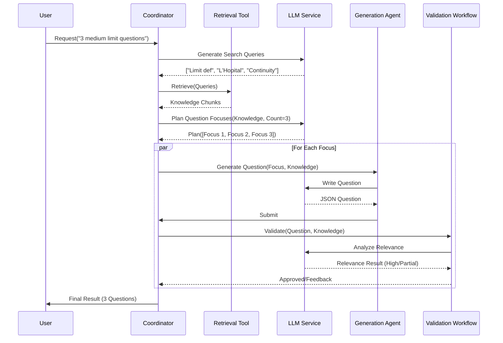

# Requirement: Custom Practice Mode (Knowledge-Driven)

## 🎯 User Stories

### Learner
**As a** Learner,
**I want to** generate targeted practice exercises based on my current knowledge level and specific topics,
**So that** I can reinforce my understanding of weak areas and prepare for upcoming assessments.

**Acceptance Criteria:**
- The system accepts natural language requirements (e.g., "medium difficulty questions about calculus limits").
- The system retrieves relevant background knowledge from the course knowledge base.
- The system generates a configurable number of unique questions.
- Each question includes a detailed explanation and correct answer.
- The system validates that the generated questions are relevant to the requested topic.

## 🔧 Detailed Design

### Logic Flow

The Custom Practice Mode follows a strict **Research -> Plan -> Execute** pipeline. This ensures that questions are distinct from each other and grounded in facts.

#### Mermaid Sequence Diagram



### Algorithm Description

1.  **Requirement Interpretation**:
    -   The `AgentCoordinator` first uses an LLM call to parse the user's natural language input into a structured requirement object:
        ```json
        {
          "knowledge_point": "Calculus Limits",
          "difficulty": "medium",
          "question_type": "written"
        }
        ```

2.  **Stage 1: Researching (Retrieval)**:
    -   **Query Generation**: The system asks the LLM to generate `N` search queries based on the topic.
    -   **Parallel Retrieval**: These queries are executed against the RAG system (Vector DB) in parallel.
    -   **Summarization**: The results are aggregated into a single "Background Knowledge" text block.

3.  **Stage 2: Planning**:
    -   The system asks the LLM to create a **Question Plan**. It provides the background knowledge and asks for `N` distinct "Focuses".
    -   This prevents duplicates (e.g., ensuring not all 3 questions test the exact same formula).

4.  **Stage 3: Generating (Parallel Execution)**:
    -   The coordinator spawns a `QuestionGenerationAgent` for each focus in the plan.
    -   **Generation**: The agent uses a prompt template that combines the specific *Focus* + *Background Knowledge* to generate the question JSON.
    -   **Validation**: The `QuestionValidationWorkflow` analyzes the result. Unlike older versions that might reject/regenerate in a loop, the current system performs a **Relevance Analysis**. It classifies the question as "High Relevance" (fully supported by KB) or "Partial Relevance" (extends beyond KB).

### Data Structures

#### Question Plan
The blueprint generated during the planning phase.
```json
{
  "focuses": [
    {
      "id": "q_1",
      "focus": "Test continuity definition at a point",
      "type": "choice"
    },
    {
      "id": "q_2",
      "focus": "Calculate limit using L'Hopital's rule",
      "type": "written"
    }
  ]
}
```

#### Generated Question (JSON)
The final artifact produced by the agent.
```json
{
  "question_type": "choice",
  "question": "Evaluate the limit of f(x) as x approaches 0...",
  "options": {
    "A": "0",
    "B": "1",
    "C": "Infinity",
    "D": "Undefined"
  },
  "correct_answer": "B",
  "explanation": "Using the standard limit identity sin(x)/x -> 1...",
  "knowledge_point": "Limits"
}
```

#### Validation Output
```json
{
  "relevance": "high",
  "kb_coverage": "The question tests the standard limit identity which is explicitly covered in the provided text.",
  "extension_points": ""
}
```
