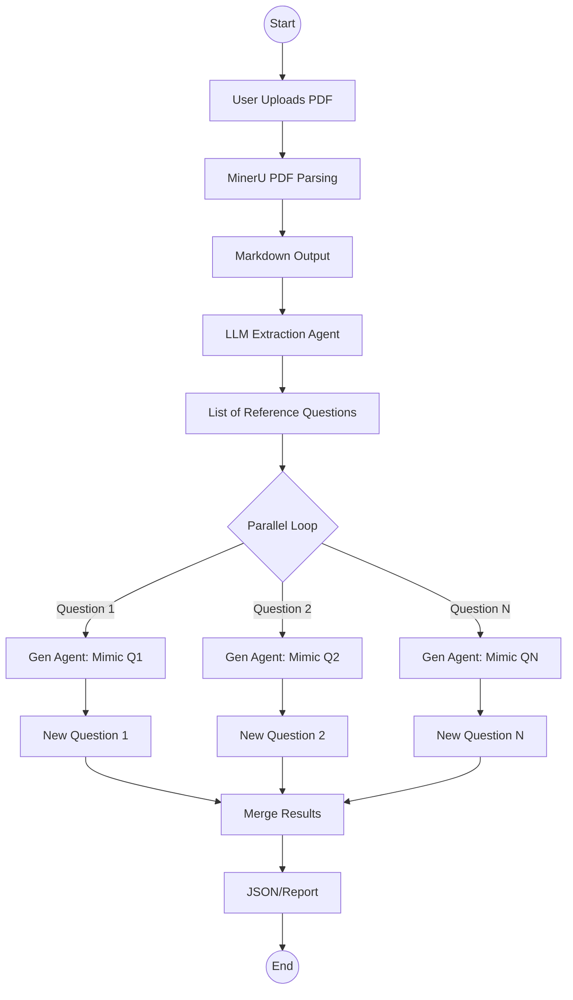

# Requirement: Exam Mimic Mode (Reference-Driven)

## 🎯 User Stories

### Learner
**As a** Learner,
**I want to** upload a past exam paper or reference questions,
**So that** I can practice with questions that mimic the exact style, format, and difficulty of the real exam.

**Acceptance Criteria:**
- The system can parse uploaded PDF exam papers (text, images, equations).
- The system identifies and extracts individual questions from the parsed content.
- The system generates new "mimic" questions for each reference question.
- The generated questions maintain the same core concept and difficulty but change the scenario/numbers.
- The system produces a comprehensive output containing the original and generated questions.

## 🔧 Detailed Design

### Logic Flow

Mimic Mode relies on a **Parse -> Extract -> Clone** pipeline. The goal is 1:1 mapping between reference questions and generated practice questions.

#### Mermaid Flowchart



### Algorithm Description

1.  **Ingestion (PDF Parsing)**:
    -   The system uses **MinerU** (via `src/agents/question/tools/pdf_parser.py`) to convert the raw PDF into a rich Markdown format.
    -   *Why MinerU?* Standard text extractors fail on mathematical formulas ($LaTeX$) and complex layout structures common in exams.

2.  **Extraction**:
    -   The `extract_questions_from_paper` tool takes the Markdown and asks an LLM to identify distinct questions.
    -   It cleans up the text, separating "Question 1" from "Question 2", and preserves links to any images referenced.

3.  **Mimicry (Parallel Generation)**:
    -   The coordinator launches a generation task for *each* extracted reference question.
    -   **Prompt Strategy**: The prompt (`src/agents/question/tools/exam_mimic.py`) is strictly engineered:
        -   **Identify Core Concept**: What math principle is being tested?
        -   **Keep Difficulty**: Do not make it easier or harder.
        -   **Change Scenario**: Change the numbers, functions, or physical setting (e.g., change "projectile motion" to "car braking" if the physics is the same).
        -   **Forbid Rejection**: The agent *must* produce a question, even if the reference is obscure.

4.  **Result Aggregation**:
    -   The system saves a structured JSON file mapping each `reference_question` to its `generated_question`.

### Data Structures

#### Reference Question
Extracted from the source PDF.
```json
{
  "question_number": "1",
  "question_text": "Calculate the integral of x^2 from 0 to 1.",
  "images": []
}
```

#### Mimic Output Entry
The pair of original vs. new.
```json
{
  "reference_question_number": "1",
  "reference_question_text": "Calculate the integral of x^2 from 0 to 1.",
  "generated_question": {
    "question": "Evaluate the definite integral of 3t^2 + 1 from t=1 to t=2.",
    "correct_answer": "8",
    "explanation": "..."
  },
  "validation": {
    "decision": "approve"
  }
}
```
