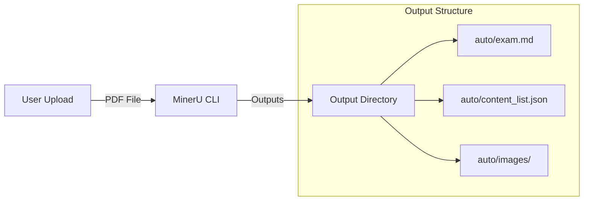
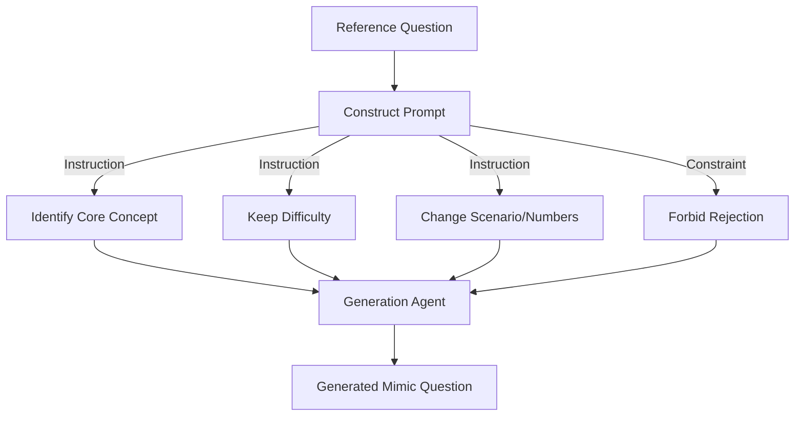
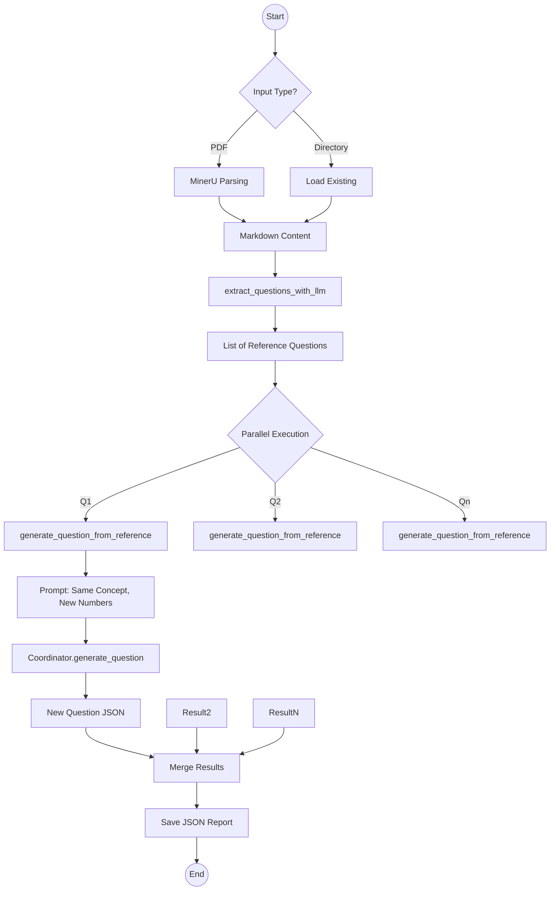

# Requirement: Exam Mimic Mode (Reference-Driven)

## 🎯 User Stories

### Granular User Stories

#### 1. Ingestion (PDF Parsing)
-   **As a system**, I want to locate the uploaded PDF exam paper or a pre-parsed directory.
-   **As a system**, I want to use `MinerU` to parse the PDF, ensuring mathematical formulas ($LaTeX$) and tables are preserved in Markdown format.
-   **As a system**, I want to extract images from the PDF and save them to an assets folder for reference.

##### Ingestion Component Diagram


#### 2. Extraction
-   **As a system**, I want to identify individual questions from the raw Markdown content using an LLM.
-   **As a system**, I want to split multiple-choice questions into "Stem" and "Options".
-   **As a system**, I want to associate extracted images with their corresponding questions.

##### Extraction Data Flow
```mermaid
flowchart TD
    MD[Markdown Content] --> LLM[LLM Extractor]
    ImgList[Image File List] --> LLM

    LLM --> JSON[Questions JSON]

    subgraph JSON Structure
    Q1[Question 1: Text + [Img1]]
    Q2[Question 2: Text + []]
    end

    JSON -- Contains --> Q1
    JSON -- Contains --> Q2
```

#### 3. Generation (Mimicry)
-   **As a system**, I want to generate a new "Mimic" question for *each* extracted reference question.
-   **As a system**, I want the new question to maintain the exact same difficulty and core concept as the reference.
-   **As a system**, I want to change the scenario, numbers, or variable names to create a unique practice problem.
-   **As a system**, I want to enforce a "No Rejection" policy to ensure every reference question gets a corresponding practice question.

##### Mimicry Process Flow


## 🔧 Detailed Design

### Function Specifications

The following table details the key functions in `src/agents/question/tools/exam_mimic.py` and `question_extractor.py`.

| Function | Signature | Purpose | Logic Details |
| :--- | :--- | :--- | :--- |
| `mimic_exam_questions` | `(pdf_path: str, kb_name: str, ...) -> dict` | **Main Orchestrator**. Manages the full pipeline: Parse -> Extract -> Generate. | 1. Checks inputs (PDF vs Directory)<br>2. Calls `parse_pdf_with_mineru` (if needed)<br>3. Calls `extract_questions_from_paper`<br>4. Loops through questions to call `generate_question_from_reference` in parallel. |
| `parse_pdf_with_mineru` | `(pdf_path: str, output_dir: str) -> bool` | high-fidelity PDF parsing. | Wraps the external `magic-pdf` (MinerU) CLI tool. Generates Markdown + Images. |
| `extract_questions_from_paper` | `(paper_dir: str) -> bool` | Extracts structured questions. | Loads markdown -> Calls `extract_questions_with_llm` -> Saves `*_questions.json`. |
| `extract_questions_with_llm` | `(markdown: str, images_dir: Path, ...) -> list` | LLM-based parsing of raw text. | Prompts LLM to split text into list of `{question_number, question_text, images}`. Handles context limits. |
| `generate_question_from_reference` | `(ref_question: dict, coordinator, kb_name) -> dict` | Generates a single mimic question. | Constructs a strict prompt: "Identify concept, keep difficulty, change scenario". Calls `coordinator.generate_question`. |

### Logic Flow

Mimic Mode relies on a **Parse -> Extract -> Clone** pipeline. The goal is 1:1 mapping between reference questions and generated practice questions.

#### Mermaid Flowchart



### Data Structures

#### Reference Question
Extracted from the source PDF.
```json
{
  "question_number": "1",
  "question_text": "Calculate the integral of x^2 from 0 to 1.",
  "images": []
}
```

#### Mimic Output Entry
The pair of original vs. new.
```json
{
  "reference_question_number": "1",
  "reference_question_text": "Calculate the integral of x^2 from 0 to 1.",
  "generated_question": {
    "question": "Evaluate the definite integral of 3t^2 + 1 from t=1 to t=2.",
    "correct_answer": "8",
    "explanation": "..."
  },
  "validation": {
    "decision": "approve"
  }
}
```
