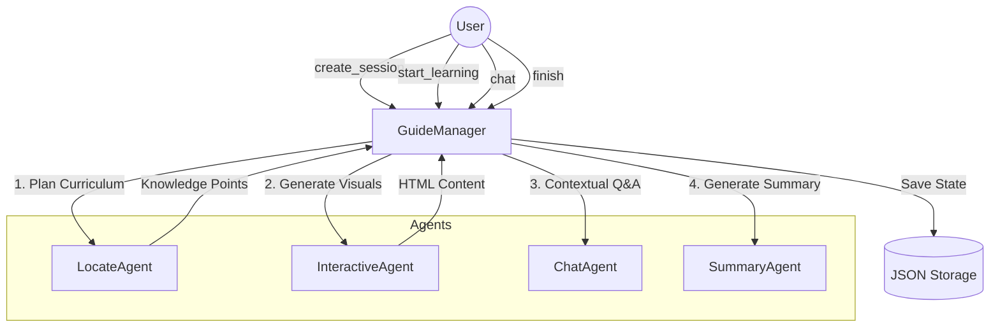
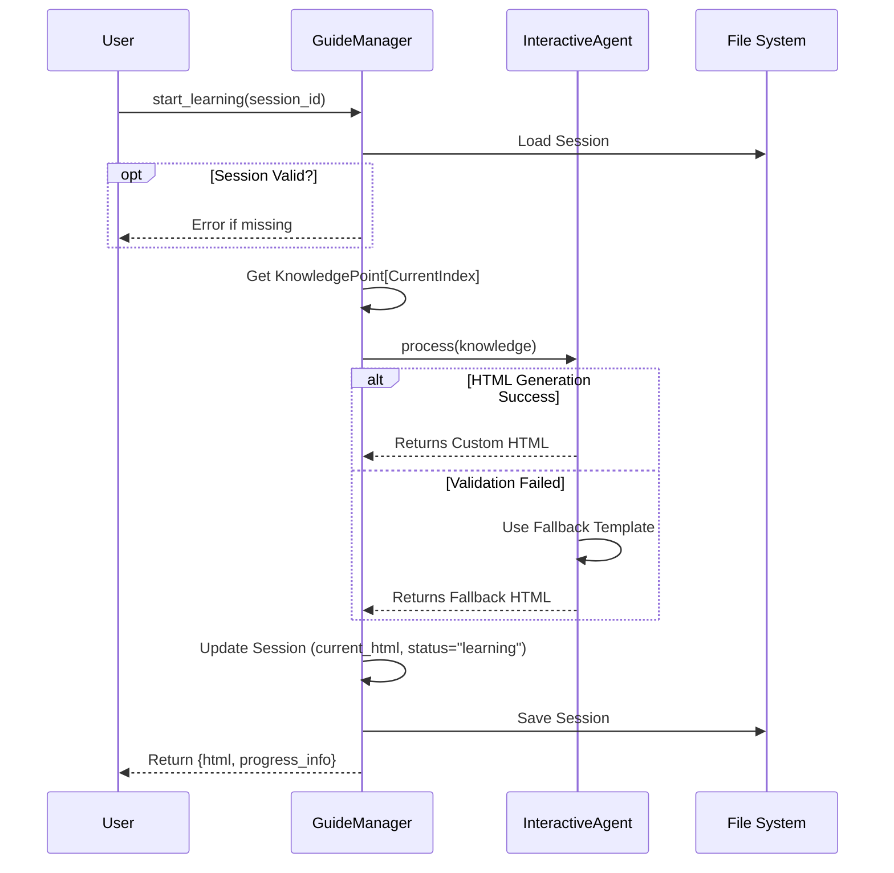

# 🎨 Interactive Learning Visualization: Architectural Reference

**Role:** Architect-Educator
**Scope:** `src/agents/guide/`

This document provides a deep dive into the **Interactive Learning Visualization** system. It transforms static notebook content into a dynamic, guided learning experience using an agent-orchestrated architecture.

---

## 🎯 User Stories

### 1. Personalized Learning Plan
**As a** Learner,
**I want** the system to analyze my notebook records and create a structured learning plan with 3-5 progressive knowledge points,
**So that** I can break down complex topics into manageable steps without feeling overwhelmed.

**Acceptance Criteria:**
- **Input:** Notebook ID and list of records (Question, Research, Solve output).
- **Processing:** `LocateAgent` identifies core concepts and organizes them logically.
- **Output:** A list of `KnowledgePoint` objects (Title, Summary, Difficulty).
- **Error Handling:** If no valid records exist, return an explicit error message.

### 2. Interactive Visualization
**As a** Visual Learner,
**I want** to see an interactive HTML page explaining the current knowledge point,
**So that** I can understand abstract concepts through visual aids rather than just text.

**Acceptance Criteria:**
- **Trigger:** Starting a new knowledge point.
- **Generation:** `InteractiveAgent` generates a custom HTML page with Katex support.
- **Reliability:** If the generated HTML is invalid, the system automatically falls back to a safe default template.
- **Persistence:** The generated HTML is saved to the session state.

### 3. Context-Aware Q&A
**As a** Curious Student,
**I want** to ask questions about the specific topic I am currently viewing,
**So that** I can get targeted clarifications without the AI losing context or referencing unrelated topics.

**Acceptance Criteria:**
- **Context:** `ChatAgent` receives the current `knowledge_index` context.
- **Scoping:** Chat history is filtered; the AI primarily considers the current topic's history.
- **History:** All interactions are logged in the global session history.

---

## 🏗️ Basic Design (High-Level)

### Purpose
To solve the problem of **information overload** in raw notebook outputs by converting them into a **linear, interactive curriculum**.

### Architecture
The system follows an **Agent-Orchestrated Service Pattern**. The `GuideManager` acts as the central state machine, coordinating specialized agents for planning, visualization, and interaction.

#### Component Diagram



### Core Dependencies
- **`GuideManager`**: Lifecycle and state management.
- **`LocateAgent`**: Curriculum planning (LLM-based).
- **`InteractiveAgent`**: HTML/JS generation (LLM-based).
- **`ChatAgent`**: Context-aware Q&A.
- **`SummaryAgent`**: Session completion summary.
- **Storage**: Local filesystem (JSON) for session persistence.

---

## 🔧 Detailed Design (Technical Deep-Dive)

### 1. Logic Flow: Learning Session Lifecycle

#### Phase 1: Initialization (`create_session`)
1.  **Input**: Notebook data.
2.  **Analysis**: `LocateAgent` analyzes records to extract `KnowledgePoints`.
3.  **State Creation**: A `GuidedSession` object is created with `status="initialized"`.
4.  **Persistence**: Saved to `data/user/guide/session_{uuid}.json`.

#### Phase 2: Active Learning (`start_learning` / `next_knowledge`)
This flow handles the transition between knowledge points.



#### Phase 3: Interaction (`chat`)
1.  **Context Scoping**: The manager filters the global chat history.
    - `relevant_history = [msg for msg in history if msg.knowledge_index == current_index]`
2.  **Processing**: `ChatAgent` generates a response based on the *specific* knowledge point.
3.  **Logging**: The user query and AI response are appended to `chat_history` with the current `knowledge_index`.

### 2. Data Structures

#### `GuidedSession` Schema (JSON)
```json
{
  "session_id": "uuid-string",
  "notebook_id": "string",
  "created_at": 1234567890.0,
  "status": "initialized | learning | completed",
  "current_index": 0,
  "knowledge_points": [
    {
      "knowledge_title": "Concept A",
      "knowledge_summary": "Description...",
      "user_difficulty": "Why this is hard..."
    }
  ],
  "chat_history": [
    {
      "role": "user",
      "content": "Explain this graph.",
      "knowledge_index": 0,
      "timestamp": 1234567899.0
    }
  ],
  "current_html": "<!DOCTYPE html>...",
  "summary": "Final session summary..."
}
```

### 3. Edge Case Handling

| Scenario | Handling Strategy |
| :--- | :--- |
| **LLM Generates Invalid HTML** | `InteractiveAgent._validate_html` checks for basic tags. If failed, it returns a hardcoded **Fallback Template** that displays text content safely. |
| **No Records in Notebook** | `LocateAgent` returns an empty list; `GuideManager` aborts session creation with a clear error message. |
| **Server Restart** | Sessions are stateless in memory but persisted on disk. `_load_session` reconstructs the full state object from JSON on any request. |
| **User Skips Ahead** | The system enforces linear progression via `next_knowledge`. Random access is not currently exposed in the public API to ensure pedagogical flow. |

---

## 💡 Learning Insight: "Context Scoping"

**Concept:** How does the AI know what we are talking about *right now*?

Imagine you are reading a textbook. When you are on **Chapter 1**, you don't want your tutor to answer questions using information from **Chapter 10** that you haven't learned yet, or get confused by a question you asked yesterday about the Preface.

In this system, we use **Context Scoping**.
Every time you send a message, it is "tagged" with a page number (the `knowledge_index`).

When the `ChatAgent` wakes up to answer you, the `GuideManager` acts like a filter. It says:
> *"Here is the user's question. Only look at the conversation history from **Page 1**. Ignore the chat history from Page 2 or Page 3."*

**Code Logic Simplified:**
```python
# In GuideManager.chat()
current_history = [
    msg
    for msg in session.chat_history
    if msg.get("knowledge_index") == session.current_index
]
```
This ensures the AI stays focused on the exact concept you are learning, providing accurate and relevant help.
