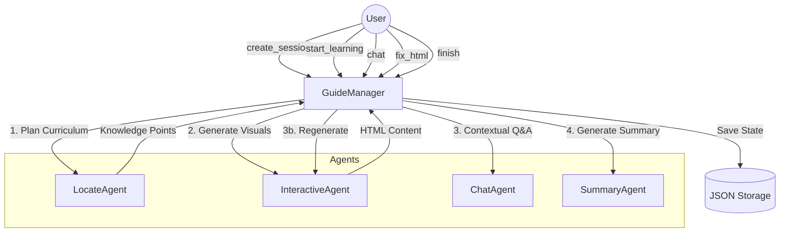

# 🎨 Interactive Learning Visualization: Architectural Reference

**Role:** Architect-Educator
**Scope:** `src/agents/guide/`

This document provides a deep dive into the **Interactive Learning Visualization** system. It transforms static notebook content into a dynamic, guided learning experience using an agent-orchestrated architecture.

---

## 🎯 User Stories

### 1. Personalized Learning Plan (Curriculum Generation)
**As a** Learner with a notebook full of raw research and QA records,
**I want** the system to generate a structured curriculum with 3-5 progressive knowledge points,
**So that** I can navigate the material in a logical sequence instead of reading unstructured logs.

**Acceptance Criteria:**
- **Input:** A specific Notebook ID.
- **Processing:** The system invokes `LocateAgent` to analyze the notebook's semantic content.
- **Output:** A persisted session containing a list of `KnowledgePoint` objects.
- **Feedback:** If the notebook is empty or analysis fails, the user receives a clear "Analysis Failed" error message.

### 2. Interactive Visualization (Active Learning)
**As a** Visual Learner,
**I want** each knowledge point to be presented as an interactive HTML page with mathematical rendering and styled content,
**So that** I can digest complex concepts (like algorithms or equations) more easily than plain text.

**Acceptance Criteria:**
- **Trigger:** Moving to a new knowledge point (Start or Next).
- **Generation:** `InteractiveAgent` creates a custom HTML page tailored to the specific concept.
- **Reliability:** If the AI generates broken HTML, the system silently swaps it for a robust "Fallback Template" so my learning is never interrupted.
- **State:** The generated visual persists so I can return to it later.

### 3. Context-Aware Q&A (Targeted Assistance)
**As a** Student stuck on a specific concept,
**I want** to ask questions that the AI answers *only* using information relevant to the current topic,
**So that** I don't get confused by advanced concepts from later chapters or irrelevant details from previous ones.

**Acceptance Criteria:**
- **Scoping:** The AI sees my question + the current knowledge point info + only the chat history *for this specific point*.
- **Logging:** My question and the AI's answer are saved with a "page number" tag (`knowledge_index`).

### 4. Visual Debugging (Fix HTML)
**As a** User noticing a rendering glitch (e.g., a broken formula or overlapping text),
**I want** to describe the visual bug to the system,
**So that** the AI can regenerate the HTML code to fix the display issue without losing my place.

**Acceptance Criteria:**
- **Input:** A natural language description of the bug (e.g., "The equation text is too small").
- **Processing:** `InteractiveAgent` is re-called with the original content AND the bug report.
- **Output:** The page refreshes with the corrected HTML.

### 5. Session Resumption & Continuity
**As a** Busy Learner who studies in short bursts,
**I want** my progress, chat history, and current visual to be saved automatically,
**So that** I can close the browser and pick up exactly where I left off days later.

**Acceptance Criteria:**
- **Persistence:** Every state change (chat, next topic, generated page) is immediately written to disk (`session_{id}.json`).
- **Restoration:** Loading a session ID restores the exact state machine status (`learning`, `index`, `html`).

### 6. Learning Summary
**As a** Learner who has finished the curriculum,
**I want** a comprehensive summary of what I've learned,
**So that** I can review key takeaways and assess my mastery.

**Acceptance Criteria:**
- **Trigger:** Completing the final knowledge point.
- **Processing:** `SummaryAgent` reviews the entire curriculum and my chat history.
- **Output:** A text summary displayed in the UI, marking the session status as `completed`.

---

## 🏗️ Basic Design (High-Level)

### Purpose
To solve the problem of **information overload** in raw notebook outputs by converting them into a **linear, interactive curriculum**.

### Architecture
The system follows an **Agent-Orchestrated Service Pattern**. The `GuideManager` acts as the central state machine, coordinating specialized agents for planning, visualization, and interaction.

#### Component Diagram



---

## 🔧 Detailed Design: Component Specification

### 1. Class: `GuideManager`
**Role:** Central Controller & State Machine.
**Location:** `src/agents/guide/guide_manager.py`

#### Method: `create_session`
*   **Purpose:** Initializes a new learning journey.
*   **Inputs:** `notebook_id` (str), `notebook_name` (str), `records` (List[dict]).
*   **Logic:**
    1.  Generates a short UUID for `session_id`.
    2.  Calls `LocateAgent.process(notebook_data)` to get a list of knowledge points.
    3.  If successful, creates a `GuidedSession` object with `status="initialized"`.
    4.  Calls `_save_session()` to persist data.
*   **Outputs:** `dict` containing `session_id`, `knowledge_points`, and success status.
*   **Edge Cases:** Returns failure if `LocateAgent` fails or returns 0 points.

#### Method: `start_learning`
*   **Purpose:** Transitions state from `initialized` to `learning`.
*   **Inputs:** `session_id` (str).
*   **Logic:**
    1.  Loads session. Checks existence.
    2.  Gets the **first** knowledge point (Index 0).
    3.  Calls `InteractiveAgent.process(knowledge)` to generate HTML.
    4.  Updates session: `current_index=0`, `status="learning"`, `current_html=...`.
    5.  Logs a system message ("Starting to learn...").
    6.  Saves session.
*   **Outputs:** `dict` with `html`, `current_knowledge`, `progress`.

#### Method: `next_knowledge`
*   **Purpose:** Advances the user to the next topic OR triggers completion.
*   **Inputs:** `session_id` (str).
*   **Logic:**
    1.  Calculates `new_index = current_index + 1`.
    2.  **Check Completion:** If `new_index >= total_points`:
        -   Calls `SummaryAgent.process()`.
        -   Updates state to `completed`.
        -   Returns summary.
    3.  **Else (Continue):**
        -   Retrieves `knowledge_points[new_index]`.
        -   Calls `InteractiveAgent.process()` for new HTML.
        -   Updates state: `current_index = new_index`.
        -   Logs system transition message.
        -   Saves session.
*   **Outputs:** `dict` with new HTML (if continuing) or Summary (if finished).

#### Method: `chat`
*   **Purpose:** Handles user Q&A with context scoping.
*   **Inputs:** `session_id` (str), `user_message` (str).
*   **Logic:**
    1.  Verifies status is `learning`.
    2.  **Context Scoping:** Filters `session.chat_history`:
        -   `relevant_history = [msg for msg in history if msg.knowledge_index == current_index]`
    3.  Appends User Message to history (tagged with index).
    4.  Calls `ChatAgent.process(knowledge, relevant_history, question)`.
    5.  Appends Assistant Answer to history (tagged with index).
    6.  Saves session.
*   **Outputs:** `dict` with `answer`.

#### Method: `fix_html`
*   **Purpose:** Regenerates the current visual based on user feedback.
*   **Inputs:** `session_id`, `bug_description`.
*   **Logic:**
    1.  Retrieves current knowledge point.
    2.  Calls `InteractiveAgent.process(knowledge, retry_with_bug=bug_description)`.
    3.  Updates `session.current_html` with result.
    4.  Saves session.
*   **Outputs:** `dict` with new `html`.

---

### 2. Class: `InteractiveAgent`
**Role:** Generates and validates HTML visualizations.
**Location:** `src/agents/guide/agents/interactive_agent.py`

#### Method: `process`
*   **Inputs:** `knowledge` (dict), `retry_with_bug` (Optional[str]).
*   **Logic:**
    1.  Selects Prompt:
        -   Standard: "Generate an educational HTML page for {title}..."
        -   Retry: "Fix the following issues: {bug}..."
    2.  Calls LLM.
    3.  **Extraction:** Extracts content between ` ```html ` tags using regex.
    4.  **Validation:** Calls `_validate_html()`.
        -   Checks for required tags (`<html`, `<body`, etc.).
    5.  **Fallback:** If validation fails, calls `_generate_fallback_html()`.
*   **Outputs:** `dict` with `html`, `is_fallback` (bool).

#### Method: `_generate_fallback_html` (Private)
*   **Purpose:** Safety net for LLM failures.
*   **Logic:** Returns a hardcoded Python f-string HTML template with:
    -   Standard CSS styling (Cards, Tailwind-like).
    -   Katex JS libraries pre-included.
    -   Knowledge content injected into the `<body>`.
*   **Benefit:** Ensures the user never sees a blank screen or raw JSON error.

---

### 3. Class: `LocateAgent`
**Role:** Curriculum Planner.
**Location:** `src/agents/guide/agents/locate_agent.py`

#### Method: `process`
*   **Inputs:** `notebook_records` (List).
*   **Logic:**
    1.  Formats records into a readable text block.
    2.  Prompt: "Analyze these records. Identify 3-5 core knowledge points. Order them progressively."
    3.  Request `json_object` format from LLM.
    4.  Parses and validates the JSON list.
*   **Outputs:** `dict` containing `knowledge_points`.

---

### 4. Class: `ChatAgent`
**Role:** Contextual Q&A.
**Location:** `src/agents/guide/agents/chat_agent.py`

#### Method: `process`
*   **Inputs:** `knowledge` (dict), `chat_history` (List), `user_question` (str).
*   **Logic:**
    1.  Constructs prompt with:
        -   **Current Context:** "The user is learning about {title}: {summary}"
        -   **History:** "Previous relevant questions: {history}"
        -   **Instruction:** "Answer concisely. Do not reference unrelated topics."
    2.  Calls LLM.
*   **Outputs:** `dict` with `answer`.

---

## 📊 Data Structures

#### `GuidedSession` Schema (JSON)
Stored in `data/user/guide/session_{uuid}.json`.

```json
{
  "session_id": "a1b2c3d4",
  "notebook_id": "nb_123",
  "created_at": 1715000000.0,
  "status": "learning",
  "current_index": 1,
  "current_html": "<!DOCTYPE html>...",
  "knowledge_points": [
    {
      "knowledge_title": "1. Vector Embeddings",
      "knowledge_summary": "Vectors represent semantic meaning...",
      "user_difficulty": "Concept of high-dimensional space."
    },
    {
      "knowledge_title": "2. Cosine Similarity",
      "knowledge_summary": "Measuring distance between vectors...",
      "user_difficulty": "Math formula understanding."
    }
  ],
  "chat_history": [
    {
      "role": "user",
      "content": "What is a vector?",
      "knowledge_index": 0,
      "timestamp": 1715000010.0
    },
    {
      "role": "assistant",
      "content": "A vector is...",
      "knowledge_index": 0,
      "timestamp": 1715000015.0
    }
  ],
  "summary": ""
}
```

## 💡 Learning Insight: "State Machine Pattern"

**Concept:** How does the system know "where" you are?

The `GuideManager` implements a **State Machine**. This is a design pattern where the system can only be in one of a few specific "states" at a time, and it moves between them based on specific "events".

- **State 1: Initialized**: The plan is ready, but you haven't started.
- **State 2: Learning**: You are actively viewing content. The `current_index` variable tracks exactly which page (0, 1, 2...) you are on.
- **State 3: Completed**: You finished everything.

**Why use this?**
It makes the code predictable. For example, the `chat()` function checks `if status == 'learning'`. This prevents bugs like trying to ask a question before the session is created or after it's closed.
